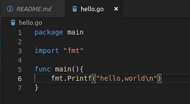
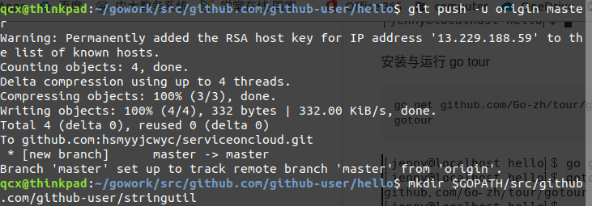

# ubuntu 18.04 下Go编程

由于以前安装好了Vscode,所以直接从golang安装开始.

## 环境配置

```
sudo apt install golang
```

开始下载.

````
mkdir $HOME/gowork
````

检测安装好的版本为1.10.4

#### 设置GOPATH

```
export GOPATH=$HOME/gowork
export PATH=$PATH:$GOPATH/bin
source $HOME/.profile
```


#### 测试hellogo




#### 安装git

```
sudo apt install git
```

本机之前已经安装好.

安装 go 的一些工具

下载源代码到本地

```
mkdir $GOPATH/src/golang.org/x/
go get -d github.com/golang/tools
cp $GOPATH/src/github.com/golang/tools $GOPATH/src/golang.org/x/ -rf
```

安装工具包

```
go install golang.org/x/tools/go/buildutil
```

安装运行 hello world

```
go install github.com/github-user/hello
hello
```


安装与运行 go tour

```
go get github.com/Go-zh/tour/gotour
gotour
```


接着将hello文件夹关联到github上的新的repository



由于上学期数据库已经具体讲解过有关git,以及github的任务内容,这里变不在进行多余的赘述.


接下来让我们编写一个库，并让 `hello` 程序来使用它。

同样，第一步还是选择包路径（我们使用 `github.com/user/stringutil`） 并创建包目录：

```
mkdir $GOPATH/src/github.com/github-user/stringutil
```

接着，在该目录中创建名为 `reverse.go` 的文件，内容如下：

```
// stringutil 包含有用于处理字符串的工具函数。
package stringutil

// Reverse 将其实参字符串以符文为单位左右反转。
func Reverse(s string) string {
	r := []rune(s)
	for i, j := 0, len(r)-1; i < len(r)/2; i, j = i+1, j-1 {
		r[i], r[j] = r[j], r[i]
	}
	return string(r)
}
```

现在用 `go build` 命令来测试该包的编译：

```
go build
```

确认 `stringutil` 包构建完毕后，修改原来的 `hello.go` 文件（它位于`$GOPATH/src/github.com/gihub-user/hello`）去使用它：

```
package main

import (
	"fmt"

	"github.com/github-user/stringutil"
)

func main() {
	fmt.Printf(stringutil.Reverse("!oG ,olleH"))
}
```

安装 `hello` 程序,要注意如果已经在对应的文件夹那么,直接使用go install变可以了,否则会找不到文件

```
go install github.com/user/hello
```

运行此程序的新版本，能看到一条新的，反向的信息：

```
$ hello
Hello, Go!
```


这里有包括检查和,hello程序的执行结果.

对于go文件,所有的可执行文件最后都在bin文件夹里了


由于是第一次实验,担心会由于神器操作导致实验失败,所有步骤,包括在github上又建立了一个service的库,并关联到实验要求重点hello文件夹中,但是作业以后打算都放在提前建好的库里,和3D在一个文件夹下方便管理和提交.

感谢观看.