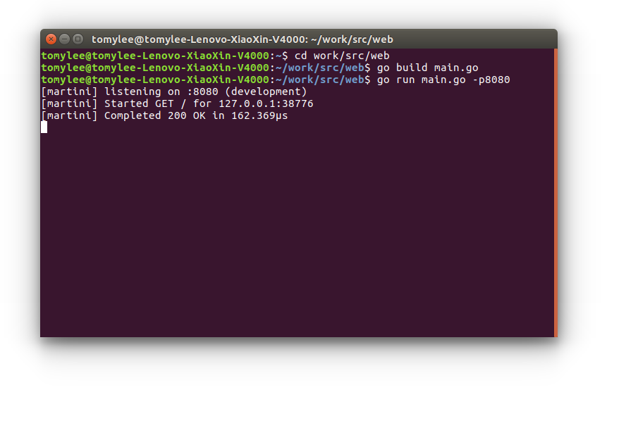
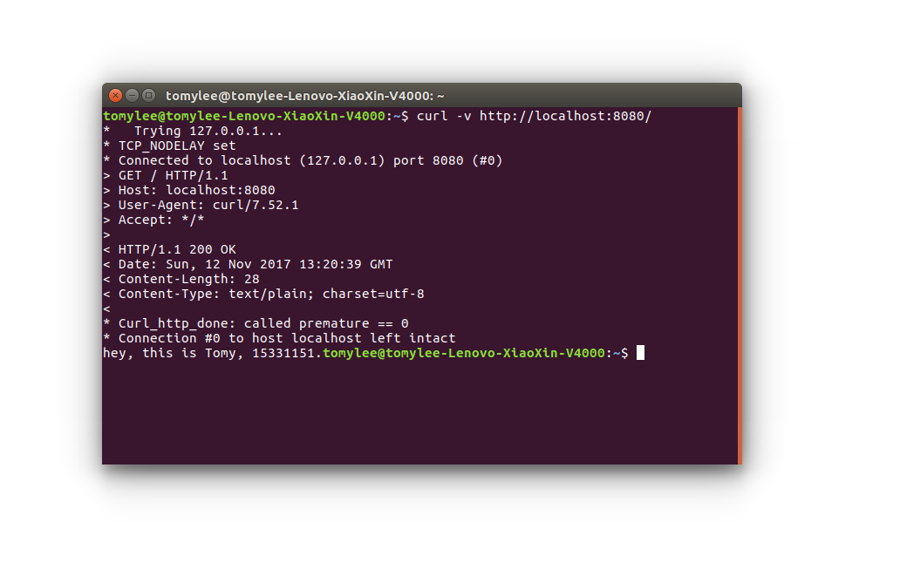

# cloudio简单开发测试

秦晨曦 17343096

```
本次使用的web开发框架是Martini。
1.使用非常简单
2.无侵入设计
3.可与其他 Go 的包配合工作
```
```golang
package main

import "github.com/codegangsta/martini"

func main() {
  m := martini.Classic()
  m.Get("/", func() string {
    return "Hello world!"
  })
  m.Run()
}
```
请求处理器：
```golang
m.Get("/", func() {
  println("hello world")
})

m.Get("/", func(res http.ResponseWriter, req *http.Request) { // res and req are injected by Martini
  res.WriteHeader(200) // HTTP 200
})
```

---

#### 1.首先使用命令go get从Github上下载或更新Martini的代码包及其依赖包。

```
go get github.com/go-martini/martini
```
#### 2.main.go以及server.go代码的编写，此处不再赘述，对于重要函数解释体现在代码中。
#### 3.编译运行，开始监听我设置的8080端口。

#### 4.打开`http://localhost:8080/` 查看输出结果。
#### 5.curl测试，用户程序可读性良好，程序扩展自然。

#### 6.使用命令ab执行Apache web 压力测试程序：
```
Document Path:          /  ###请求的资源
Document Length:        28 bytes  ###文档返回的长度，不包括相应头


Concurrency Level:      1   ###并发个数
Time taken for tests:   1.116 seconds   ###总请求时间
Complete requests:      5000     ###总请求数
Failed requests:        0     ###失败的请求数
Total transferred:      725000 bytes
HTML transferred:       140000 bytes
Requests per second:    4481.76 [#/sec] (mean)      ###平均每秒的请求数
Time per request:       0.223 [ms] (mean)     ###平均每个请求消耗的时间
Time per request:       0.223 [ms] (mean, across all concurrent requests)  ###上面的请求除以并发数
Transfer rate:          634.62 [Kbytes/sec] received   ###传输速率


Connection Times (ms)
              min  mean[+/-sd] median   max
Connect:       0    0   0.0     0        0
Processing:    0    0   0.1     0        4
Waiting:       0    0   0.1     0        4
Total:         0    0   0.1     0        4


Percentage of the requests served within a certain time (ms)
  50%  0   ###50%的请求都在0ms内完成
  66%  0
  75%  0
  80%  0
  90%  0
  95%  0
  98%  1
  99%  1
 100%  4 (longest request)
```